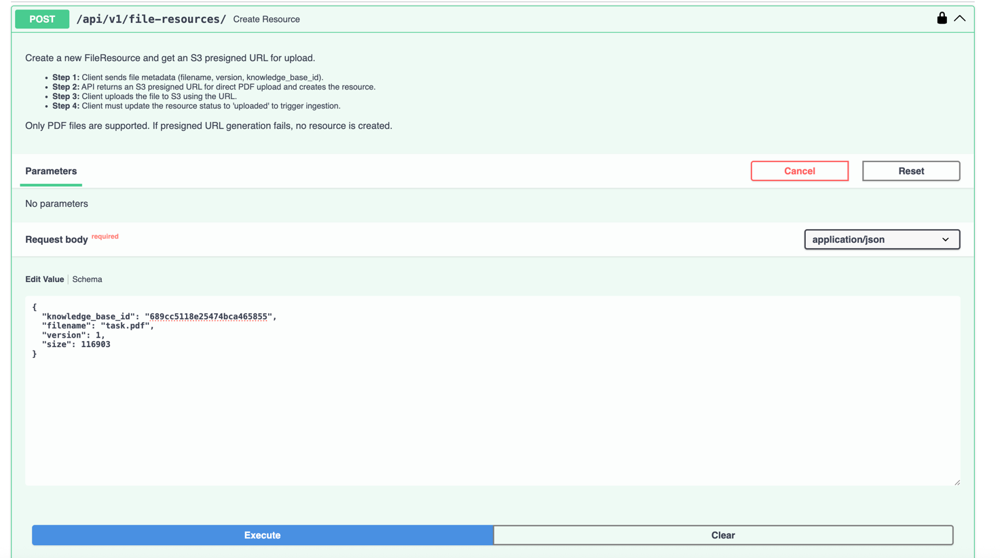
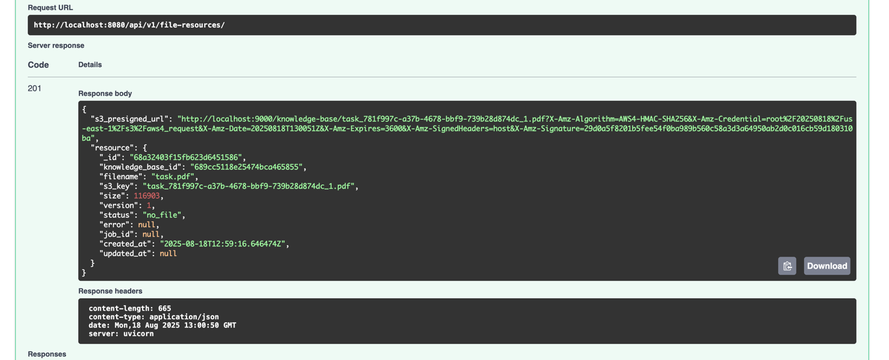
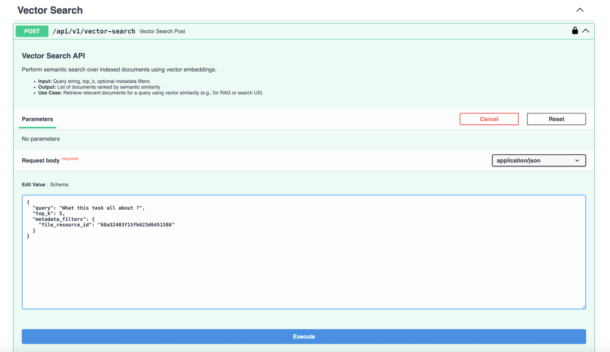
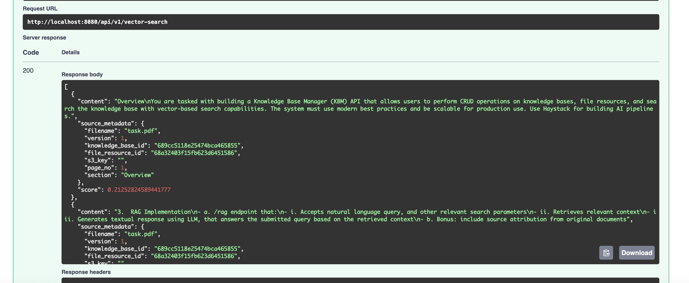
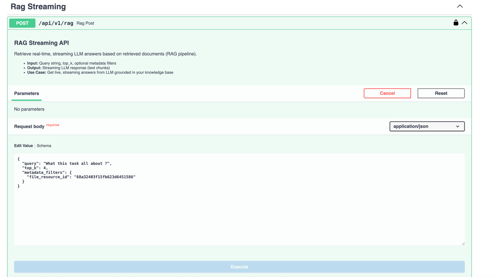
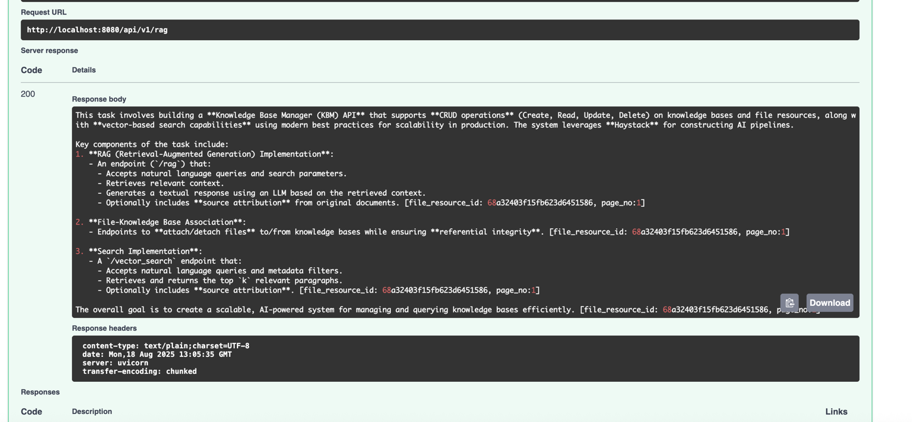
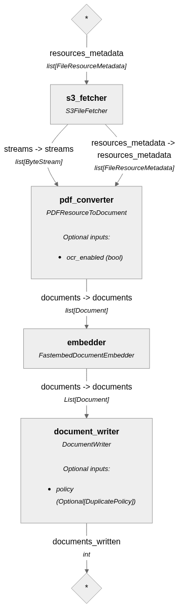
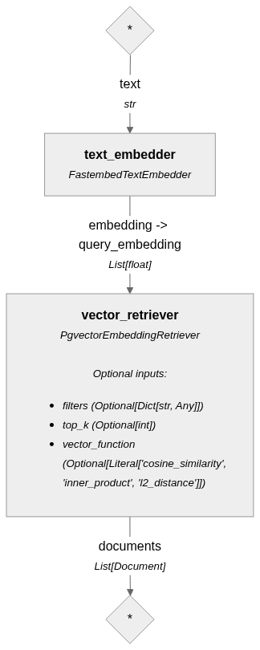
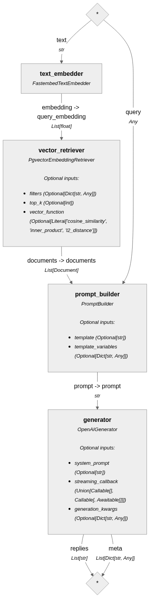

# Knowledge Base AUI

## Getting Started


1. Copy `.env.example` to `.env` and `.env.docker` as needed, and edit the values for your environment.

2. Start the stack:
   ```sh
   docker-compose --env-file .env.docker -f .docker-compose-dev.yaml -p knowledge_base_aui up -d

   ```
   _Environment variables will be loaded from `.env` or `.env.docker` automatically._
---
   #### python for local development instead of docker
1. install uv, follow instructions here https://docs.astral.sh/uv/getting-started/installation/#standalone-installer

2. install project dependencies: 
3. ```sh
   uv pip install .
   ```
4. run the app:
   ```sh
   uvicorn app.main:app --reload --loop uvloop 
   ```
---
   ### URLs:
   1. http://localhost:8000/docs for swagger documentation
   2. http://localhost:9181 for rq-dashboard to monitor running background tasks

---
## Environment Variables

The following environment variables must be set (in `.env` for development or `.env.example` as a template):

**MongoDB Configuration**

| Field Name                   | Type    | Default Value   | Description                  |
|------------------------------|---------|-----------------|------------------------------|
| `MONGO_INITDB_ROOT_USERNAME` | string  | `admin`         | MongoDB root username        |
| `MONGO_INITDB_ROOT_PASSWORD` | string  | `admin`         | MongoDB root password        |
| `MONGODB_HOST`               | string  | `"localhost"`   | MongoDB host address         |
| `MONGODB_PORT`               | string  | `"27017"`       | MongoDB port number          |
| `MONGODB_DB`                 | string  | `knowledge_base`| MongoDB database name        |

**PostgreSQL Configuration**

| Field Name         | Type   | Default Value   | Description            |
|--------------------|--------|-----------------|------------------------|
| `POSTGRES_HOST`    | string | `"localhost"`   | PostgreSQL host address|
| `POSTGRES_PORT`    | string | `"5432"`        | PostgreSQL port number |
| `POSTGRES_USER`    | string | `admin`         | PostgreSQL username    |
| `POSTGRES_PASSWORD`| string | `admin`         | PostgreSQL password    |
| `POSTGRES_DB`      | string | `knowledge_base`| PostgreSQL database name|

**AWS/S3 Configuration**

| Field Name             | Type   | Default Value           | Description                     |
|------------------------|--------|-------------------------|---------------------------------|
| `AWS_ACCESS_KEY_ID`    | string | `aws_key`               | AWS access key ID               |
| `AWS_SECRET_ACCESS_KEY`| string | `aws_secret`            | AWS secret access key           |
| `AWS_DEFAULT_REGION`   | string | `us-east-1`             | AWS region                      |
| `AWS_BUCKET_NAME`      | string | `knowledge-base`        | S3 bucket name                  |
| `AWS_S3_ENDPOINT_URL`  | string | `"http://localhost:9000"`| S3 endpoint URL (for MinIO)     |

**Redis Configuration**

| Field Name  | Type   | Default Value   | Description         |
|-------------|--------|-----------------|---------------------|
| `REDIS_HOST`| string | `"localhost"`   | Redis host address  |
| `REDIS_PORT`| string | `"6379"`        | Redis port number   |

**General Configuration**

| Field Name | Type   | Default Value  | Description            |
|------------|--------|----------------|------------------------|
| `APP_ENV`  | string | `"local"`      | Application environment|
| `API_KEY`  | string | `"my_api_key"` | API authentication key |

**OpenAI Configuration**

| Field Name           | Type   | Default Value           | Description         |
|----------------------|--------|-------------------------|---------------------|
| `OPENAI_API_KEY`     | string | `"your_openai_api_key"` | OpenAI API key      |
| `OPENAI_API_BASE_URL`| string | `"your_openai_api_base_url"` | OpenAI API base URL|

**Other**

| Field Name               | Type    | Default Value | Description                        |
|--------------------------|---------|---------------|------------------------------------|
| `TOKENIZERS_PARALLELISM` | boolean | `false`       | Enable/disable tokenizer parallelism|

Copy `.env.example` to `.env` and fill in your values before starting the application.

---
Project Structure
---

• app/
  - components/
    - converters/
      - [pdf_resource.py](app/components/converters/pdf_resource.py) — PDF → Haystack Documents (OCR, metadata)
    - fetchers/
      - [s3.py](app/components/fetchers/s3.py) — Async S3/MinIO file fetcher
    - pipelines/
      - [pdf_indexer.py](app/components/pipelines/pdf_indexer.py) — PDF indexing pipeline (ingest → embed → write)
      - [rag.py](app/components/pipelines/rag.py) — RAG generation pipeline
      - [vector_search.py](app/components/pipelines/vector_search.py) — Vector search pipeline
    - [document_store.py](app/components/document_store.py) — Pgvector document store setup
    - [generator.py](app/components/generator.py) — LLM generator (streaming)
    - [helpers.py](app/components/helpers.py) — Shared helpers
  - models/
    - [__init__.py](app/models/__init__.py) — KnowledgeBase, FileResource, StatusEnum
  - routes/
    - [__init__.py](app/routes/__init__.py)
    - [file_resources.py](app/routes/file_resources.py) — File CRUD + presigned URLs
    - [knowledge_base.py](app/routes/knowledge_base.py) — Knowledge base CRUD
    - [rag.py](app/routes/rag.py) — RAG streaming endpoint
    - [vector_search.py](app/routes/vector_search.py) — Vector search endpoint
  - schemas/
    - [__init__.py](app/schemas/__init__.py)
    - [file_resources.py](app/schemas/file_resources.py) — File resource schemas
    - [knowledge_base.py](app/schemas/knowledge_base.py) — Knowledge base schemas
    - [metadata.py](app/schemas/metadata.py) — Metadata filter schemas
    - [vector_search.py](app/schemas/vector_search.py) — Search request/response
  - services/
    - [__init__.py](app/services/__init__.py)
    - [cache.py](app/services/cache.py) — FastAPI-cache2 setup
    - [clients.py](app/services/clients.py) — External clients (S3, Redis)
    - [db.py](app/services/db.py) — DB init (Postgres, pgvector)
    - [file_resources.py](app/services/file_resources.py) — File resource service layer
    - [knowledge_base.py](app/services/knowledge_base.py) — Knowledge base service layer
    - [s3.py](app/services/s3.py) — S3 utilities
    - [tasks.py](app/services/tasks.py) — Background tasks (RQ)
  - tests/
    - files/
    - [pdf_converters.py](app/tests/pdf_converters.py)
    - [pipeline_runner.py](app/tests/pipeline_runner.py)
  - [config.py](app/config.py) — App and pipeline configuration
  - [deps.py](app/deps.py) — FastAPI dependencies
  - [exceptions.py](app/exceptions.py) — Custom exceptions
  - [main.py](app/main.py) — FastAPI entrypoint

• Root
  - [.env](.env) — Environment variables
  - [.env.docker](.env.docker) — Docker env variables
  - [.env.example](.env.example) — Environment template
  - [.docker-compose-dev.yaml](.docker-compose-dev.yaml) — Development Docker setup
  - [Dockerfile](Dockerfile) — Container configuration
  - [pyproject.toml](pyproject.toml) — Project config & dependencies
  - [uv.lock](uv.lock) — Resolved dependency lockfile (uv)
  - [screenshots/](screenshots/) — Architecture and pipeline diagrams
  - [Readme.md](Readme.md) — Project documentation

---

Tech Stack
---

- FastAPI ([FastAPI](https://fastapi.tiangolo.com/)) as the backend framework to implement the API
- uv ([uv](https://github.com/astral-sh/uv)) fast dependency manager for python
- uvicorn ([uvicorn](https://www.starlette.io/)) async server for FastAPI
- dotenv ([python-dotenv](https://github.com/theskumar/python-dotenv)) management of environment variables
- docker ([docker](https://www.docker.com/)) for containerization
- docker-compose ([docker-compose](https://docs.docker.com/compose/)) for local development
- MongoDB ([MongoDB](https://www.mongodb.com/)) with vector search support
- PostgreSQL ([pgvector](https://github.com/pgvector/pgvector)) for vector DB support
- Beanie ([Beanie](https://github.com/roman-right/beanie)) as an asynchronous ODM for MongoDB
- pydantic-settings ([pydantic-settings](https://github.com/samuelcolvin/pydantic-settings)) for configuration management
- slowapi ([slowapi](https://github.com/davidgama/slowapi)) for throttling and rate limiting
- pydantic ([pydantic](https://github.com/samuelcolvin/pydantic)) for data validation and serialization
- uvloop ([uvloop](https://github.com/MagicStack/uvloop)) for improved async performance
- aioboto3 ([aioboto3](https://github.com/astral-sh/aioboto3)) for async S3/MinIO integration
- rq ([rq](https://github.com/rq/rq)) for queueing and background tasks
- rq-dashboard ([rq-dashboard](https://github.com/rq/rq-dashboard)) for monitoring queues
- haystack ([haystack](https://github.com/deepset-ai/haystack)) for rag pipeline & semantic search
- pydantic ([pydantic](https://github.com/samuelcolvin/pydantic)) for data validation and serialization
- nest_asyncio ([nest_asyncio](https://github.com/andyshinn/nest_asyncio)) for nested event loops
- fastembed ([fastembed](https://github.com/qdrant/fastembed/)) for text embedding using CPU with fast performance
- fastembed-haystack ([fastembed-haystack](https://github.com/qdrant/fastembed-haystack/)) haystack integration for text embedding using CPU with fast performance
- tiktoken ([tiktoken](https://github.com/openai/tiktoken)) for tokenization
- pgvector-haystack ([https://github.com/pgvector/pgvector)) for vector DB support
- docling-haystack ([https://github.com/deepset-ai/docling-haystack)) to parse and extract PDF documents
- docling ([https://github.com/deepset-ai/docling)) to parse and extract PDF documents
- pytesseract ([https://github.com/tesseract-ocr/tesseract)) for OCR support
- pillow ([https://pillow.readthedocs.io/en/stable/]) for image processing
- fastapi-cache2[redis] ([https://github.com/encode/fastapi-cache2]) for caching support for API layer using Redis
- orjson ([https://github.com/ijl/orjson]) for faster JSON serialization

---
## FastAPI Dependencies

- **[s3_dep](app/deps.py):** Yields an async S3 client for endpoints.
- **[verify_api_key](app/deps.py):** Checks `x-api-key` header against config; raises 401 if invalid.

---
## API Specification
### V1 API
- Prefix for all api endpoints: `/api/v1`

### API Key Authentication
All API endpoints are protected by API key authentication. Every request must include the correct API key in the `X-API-Key` HTTP header.

- The API key is loaded from the `API_KEY` environment variable (see `.env`, `.env.docker`, `.env.example`).
- If the provided key is missing or invalid, the API returns a 401 Unauthorized error.
- This is enforced globally for all endpoints.

> **Note:** If `API_KEY` is not set, the server will fail to start or will reject all requests.

### Knowledge Base Creation
- **Endpoint**: `POST /knowledge-bases/`
- **Purpose**: Create a new Knowledge Base. Name must be unique.
- `name` must be unique; duplicate names return 409 Conflict.
- Returns the created KnowledgeBase document.

### File Resource Creation & S3 Upload Flow

1. **Create Resource (POST `/file-resources/`)**
   - Client sends metadata (filename, version, knowledge_base_id) to the API.
   - API validates the filename and generates an S3 presigned URL for upload.
   - API creates a FileResource record in the database with the generated S3 key.
   - API returns the presigned URL and resource metadata to the client.

2. **Upload File to S3**
   - Client uploads the file directly to S3 using the presigned URL.
   - The API is not involved in the upload process, reducing server load and improving performance.

3. **Mark Upload Complete**
   - Client updates the FileResource status to `uploaded` (via PATCH/PUT) to trigger ingestion/indexing.

**Relevant Endpoints:**
- `POST /file-resources/` — Create resource and get presigned URL
- `PATCH /file-resources/{file_resource_id}` or `PUT /file-resources/{file_resource_id}` — Update status after upload

**Notes:**
- Only PDF files are supported for upload.
- If S3 presigned URL generation fails, no resource is created.
- File ingestion/indexing starts only after the status is set to `uploaded` or `re_ingest`.

**Example:**

* Input Screenshots:


  
* Output Screenshots:


### Re-Ingest Flow

The `re_ingest` flow allows re-processing of an existing file resource (e.g., after fixing errors or updating the pipeline):

1. **Trigger Re-Ingest**
   - Client updates the FileResource status to `re_ingest` via PATCH/PUT `/file-resources/{file_resource_id}`.
   - The API validates the status transition and starts the ingestion/indexing pipeline again for the same file.

2. **Processing**
   - The resource status is set to `ingesting`.
   - On success, the status is updated to `done`.
   - On failure, the status is set to `error` with error details.

**Notes:**
- `re_ingest` can be triggered from any status except when already `ingesting`.
- No new upload to S3 is required; the existing file is re-processed.
- Useful for retrying failed ingestions or updating extracted data after pipeline changes.

### Pagination
All list endpoints support pagination via query parameters `offset` and `limit`.
- `offset`: Number of items to skip (for paging)
- `limit`: Maximum number of items to return (1-100)

### Knowledge Base Listing
- **Endpoint**: `GET /knowledge-bases/`
- **Purpose**: List all knowledge bases with pagination support.
- **Pagination**: Supports `offset` (default 0) and `limit` (default 10, max 100).

### File Resource Listing
- **Endpoint**: `GET /file-resources/{knowledge_base_id}/`
- **Purpose**: List all file resources for a given knowledge base, with pagination.
- **Pagination**: Supports `offset` (default 0) and `limit` (default 10, max 100).

### Vector Search API

- **Endpoint:** `POST /vector-search`
- **Purpose:** Perform semantic search over indexed documents using vector embeddings.
- **Input:** Query string, optional metadata filters, top_k results.
- **Output:** List of documents ranked by semantic similarity.
- **Use Case:** Retrieve relevant documents for a query using vector similarity (e.g., for RAG or search UX).

**Example:**

* Input Screenshots:


* Output Screenshots:


### RAG Streaming API

- **Endpoint:** `POST /rag`
- **Purpose:** Retrieve real-time, streaming LLM answers based on retrieved documents (RAG pipeline).
- **Input:** Query string, optional metadata filters, top_k results.
- **Output:** Streaming LLM response (text chunks).
- **Use Case:** Get live, streaming answers from LLM grounded in your knowledge base.

**Example:**

* Input Screenshots:


* Output Screenshots:


### API Rate Limits [Bonus]
- Maximum number of requests per minute: 10
- configuration was done using `slowapi`
- can be adjusted in `config.py` using `API_RATE_LIMITS` in `app_config.py`

### Caching [Bonus]
`GET` one endpoints use Redis caching (via `fastapi-cache2`). Cache is auto-initialized, invalidated on update or delete
This will improve read performance.

### Error Handling

The API uses unified exception handling for resource errors:

- `DBDocumentNotFound` returns HTTP 404 with `{ "error": "..." }`.
- `DBDocumentConflict` returns HTTP 409 with `{ "error": "..." }` (e.g., unique constraint violations).

These are handled globally in `main.py` for consistent error responses across all endpoints.

### File Storage [Bonus]
This project supports AWS S3-compatible storage (including [MinIO](https://min.io/)) using `aioboto3` for async access.
all file uploads are uploaded to S3 and stored in a bucket named `app_config.AWS_BUCKET_NAME`.

### JSON Serialization [Bonus]
- `pydantic` is used for data validation and serialization.
- `orjson` is used for faster JSON serialization using `ORJSONResponse`.

---

Background Worker
---
- [rq](https://python-rq.org/) is used to offload CPU bound operations to a separate background worker
- The `run_pdf_indexing_task` in `app.tasks` contains background task for processing PDF files and run `pdf_index_pipeline`
- Default Task Timeout is set to 1 hour, defined in `config.py` in `app_config.TASK_TIMEOUT`
- `rq-dashboard` is used to monitor the queue and workers, accessible at `http://localhost:9181`

---

MongoDB Document Schema
---
#### KnowledgeBase Model

| Field Name   | Type                  | Description                                 |
|--------------|-----------------------|---------------------------------------------|
| name         | str | Name of the knowledge base (unique)         |
| description  | str                   | Description of the knowledge base           |
| created_at   | datetime.datetime     | Creation timestamp                          |
| updated_at   | Optional[datetime]    | Last updated timestamp                      |

#### FileResource Model

| Field Name        | Type                        | Description                                 |
|-------------------|-----------------------------|---------------------------------------------|
| knowledge_base_id | PydanticObjectId            | Reference to KnowledgeBase _id              |
| filename          | str                         | Name of the file                            |
| s3_key            | Optional[str]               | S3 key of the file                          |
| size              | Optional[int]               | Size of the file in bytes                   |
| version           | Optional[int] (default=1)   | Version of the file                         |
| status            | StatusEnum                  | Resource status                             |
| error             | Optional[str]               | Error message                               |
| job_id            | Optional[str]               | Job ID for async processing                 |
| created_at        | datetime.datetime           | Creation timestamp                          |
| updated_at        | Optional[datetime.datetime] | Last updated timestamp                      |

#### Relationships:
    KnowledgeBase (1) ────< (many) FileResource
            ^                     |
            |                     |
         _id (referenced by) knowledge_base_id

---

Pipelines
---
### Pipelines Configuration
 - found in `config.py` in `PipelineConfig` class

| Key                | Value                                                                                 |
|--------------------|---------------------------------------------------------------------------------------|
| EMBEDDING_MODEL    | sentence-transformers/all-MiniLM-L6-v2                                                |
| EMBEDDING_DIMENSION| 384                                                                                   |
| OCR_ENABLED        | True                                                                                  |
| DEFAULT_TOP_K      | 10                                                                                    |
| LLM_MODEL          | deepseek/deepseek-chat-v3-0324:free                                                   |
| LLM_SYSTEM_PROMPT  | Multi-line string (AI assistant prompt for PDF knowledge base retrieval, see code)    |

### PDF Indexing Pipeline

The PDF Index Pipeline is responsible for ingesting PDF files, extracting their content, embedding the documents, and writing them to the vector database. It is implemented using Haystack's pipeline framework and the following components:


**Notes:**
- The pipeline is triggered after a file is uploaded and marked as `uploaded` or `re_ingest`.
- All components are orchestrated by Haystack's `AsyncPipeline` class for modularity and extensibility.
- The pipeline uses the `FastembedDocumentEmbedder` for generating vector embeddings from document content. This is critical for enabling efficient semantic search and retrieval.

#### Custom Haystack Components Used:
- `S3FileFetcher` ([`S3FileFetcher`](app/components/fetchers/s3.py)): Custom Haystack component to fetch PDF files directly from S3 using async streaming. Handles authentication and efficient download for large files.
- `PDFResourceToDocument` ([`PDFResourceToDocument`](app/components/converters/pdf_resource.py)): Custom converter that parses PDF files into Haystack Document objects. Supports text extraction, metadata enrichment, and optional OCR for scanned PDFs.

#### FastembedDocumentEmbedder:
- A fast, efficient Haystack component for generating text embeddings using open-source models. Enables semantic search and retrieval using CPU.
[fastembed](https://github.com/qdrant/fastembed)

#### Why sentence-transformers/all-MiniLM-L6-v2 as Embedding Model?
- This model is a widely adopted, open-source sentence embedding model.
- It offers an excellent balance of speed, memory usage, and semantic accuracy for English text.
- Suitable for production-scale semantic search, RAG, and retrieval tasks.
- Embeddings are dense, 384-dimensional vectors, enabling efficient storage and fast vector search.
- Pretrained on diverse datasets, making it robust for a variety of domains.
- More about the model: [all-MiniLM-L6-v2 on HuggingFace](https://huggingface.co/sentence-transformers/all-MiniLM-L6-v2)

#### Document Chunking Strategy:
- Uses a **hybrid chunking strategy** via `HybridChunker` from Docling.
- Splits PDF content into context-aware chunks, optimizing for both semantic coherence and token limits.
- Chunk Size is set to 512 tokens (taken from the Embedding Model?).
- Chunks are further contextualized before embedding.
- References:
  - [Hybrid Chunking Example](https://docling-project.github.io/docling/examples/hybrid_chunking/)
  - [Docling Haystack Integration](https://docling-project.github.io/docling/examples/rag_haystack/)

#### Document Metadata
- Each document chunk is enriched with metadata during PDF conversion.
- Metadata includes: `filename`, `version`, `knowledge_base_id`, `file_resource_id`, and `page_no`.
- This metadata enables fine-grained search, filtering, and traceability in the vector database and downstream APIs.
- Metadata is attached to each chunk for accurate source attribution in RAG and search results.
- See: ([`PDFResourceToDocument`](app/components/converters/pdf_resource.py))

#### OCR Support [Bonus]:
- The PDF converter supports OCR using Tesseract for PDF files.
- OCR can be enabled per ingestion; when enabled, text is extracted from images as well as text layers.
- Useful for processing scanned documents, not just digital PDFs.
- See: ([`PDFResourceToDocument`](app/components/converters/pdf_resource.py)), [`Docling Full Page OCR`](https://docling-project.github.io/docling/examples/full_page_ocr/)

#### Acceleration
- PDF conversion leverages hardware acceleration for faster processing.
- The pipeline is configured to use the MPS (Apple Silicon GPU) device if available, with multi-threading enabled (8 threads).
- This speeds up tasks like text extraction and OCR, especially on supported hardware.
- See: ([`PDFResourceToDocument`](app/components/converters/pdf_resource.py)), [`Run with Accelerator`](https://docling-project.github.io/docling/examples/run_with_accelerator/)

### Vector Database
- Uses PostgreSQL with the pgvector extension for storing and searching document embeddings.
- All document chunks and their metadata are stored as vectors, enabling fast and accurate semantic search.
- Integrated with Haystack’s document store for seamless retrieval and RAG workflows.
- Supports similarity search, filtering, and hybrid queries.
- Default similarity function is `cosine` similarity
- See: ([`pgvector_document_store`](app/components/document_store.py))
- More info: [pgvector docs](https://github.com/pgvector/pgvector)

---

### Vector Search Pipeline

The Vector Search Pipeline is responsible for performing semantic search on the vector database. It is implemented using Haystack's pipeline framework and the following components:



**Notes:**
- All components are orchestrated by Haystack's `AsyncPipeline` class for modularity and extensibility.
- The pipeline uses the `FastembedTextEmbedder` for generating text embeddings from user queries. This is critical for enabling efficient semantic search and retrieval.

#### Retriever

- The pipeline uses `PgvectorEmbeddingRetriever` to fetch relevant document chunks from the vector database.
- Retrieves top-k documents based on vector similarity to the query embedding.
- See: ([`PgvectorEmbeddingRetriever`](app/components/pipelines/vector_search.py))


#### Filtering

- The pipeline supports filtering search results by document metadata (e.g., `knowledge_base_id`, `version`, `filename`, `page_no`).
- Filters can be provided as part of the search input to narrow results to specific knowledge bases, versions, or pages.


---

### RAG Pipeline

The RAG Pipeline is responsible for generating responses to user queries using the retrieved document chunks. It is implemented using Haystack's pipeline framework and the following components:


**Notes:**
- All components are orchestrated by Haystack's `AsyncPipeline` class for modularity and extensibility.
- The pipeline uses the `FastembedTextEmbedder` for generating text embeddings from user queries. This is critical for enabling efficient semantic search and retrieval.

#### Filtering

- The RAG pipeline supports filtering retrieved documents by metadata (e.g., `knowledge_base_id`, `version`, `filename`, `page_no`).
- This allows users to restrict LLM answers to specific file, knowledge bases, document versions, or pages.

#### LLM Generator

- The generator receives a prompt with the query and context, and streams the LLM output as the API response.
- Supports real-time streaming: responses are sent to the client as they are generated by the LLM, enabling low-latency user experiences.
- Current model is `deepseek/deepseek-chat-v3-0324:free` configured in `config.py` using `app_config.PIPELINE.LLM_MODEL`
- OpenRouter `https://openrouter.ai/` is used as the LLM provider.
- Can be configured using env vars `OPENAI_API_KEY`, `OPENAI_API_BASE_URL`
- See: ([`llm_generator`](app/components/generator.py))

##### Prompt Template Used

The generator uses the following prompt template to ground answers in retrieved documents and enforce source citation:

```
Using the following documents, answer the question below. 
For each fact or statement in your answer, cite the source in square brackets in a smaller font, e.g., [file_resource_id: {file_resource_id}, page_no:{page_no}]. 
Base your response only on the information in these documents.

Documents:

{{ doc.content }}


Sources Metadata:

- filename: {{ doc.meta.filename }}
  file_resource_id: {{ doc.meta.file_resource_id }}
  page_no: {{ doc.meta.page_no }}


Question: {{ query }}
Answer (with citations):
```

See: [`app/components/pipelines/rag.py`](app/components/pipelines/rag.py)

##### Source Citation [Bonus]

- Every answer generated by the LLM includes citations for each fact or statement, referencing the original document source.
- Citations are formatted as: [file_resource_id: <id>, page_no: <no>] (see [pdf_resource.py](app/components/converters/pdf_resource.py)) and appear in square brackets within the answer.
- This ensures full traceability and allows users to verify the provenance of each piece of information.
- The prompt template enforces citation for every statement, grounding responses in retrieved documents.